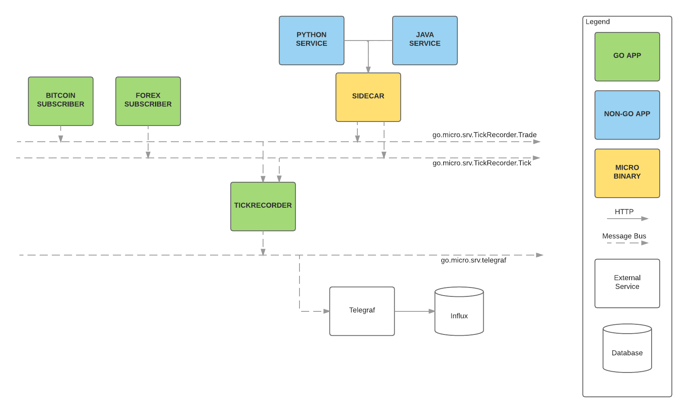

# Nii Finance Trading Swarm



This repo is a complete demo of using [Micro](https://github.com/micro/micro) and [NATS](https://nats.io). Here is the relevant [blog post](https://oren.github.io/blog/micro.html).

## Installation

### Dependencies
- [Go 1.6](https://golang.org/)
- [Glide](https://glide.sh/)
- [NATS](http://nats.io/)
- [Docker](https://www.docker.com/)

### Spinup
```
$ go get -d github.com/nii236/nii-finance/...
$ cd $GOPATH/src/github.com/nii236/nii-finance
$ glide install
$ docker build -t openalgotplatform_go:0.1 .
$ docker-compose build
$ docker-compose up
```

## Usage

In its current state, the swarm will:
- Subscribe to the IB Gateway
- Pull out USDJPY ticker data
- Publish onto the NATS queue
- Be received by the tickRecorder service
- Write the data point into InfluxDB

## Things that you can do with this setup

### For OS X Users
If you use OS X (like myself), you'll need to know what your docker IP is and substitute that for any `localhost` you see below.

```
docker-machine ip
```

Will give you your docker machine's IP.

### Micro Web Console

http://localhost:8082

### NATS

Install nats-top
```
go get github.com/nats-io/nats-top
```

Run nats-top
```
nats-top
```

### InfluxDB

Web console: http://localhost:8083  
Change the database at the top right to `openalgot` and run this query: `select * from trade`


## Contributing

1. Fork it!
2. Create your feature branch using `git flow feature start my-new-feature`
3. Commit your changes: `git commit -am 'Add some feature'`
4. Push to the branch: `git push origin my-new-feature`
5. Submit a pull request

### Ideas

- A service that writes into MongoDB instead of InfluxDB
- A service that calculates indicators based on drip feed data on NATS
- A service that opens and closes trades for you
- A service that pulls historical data from InfluxDB in a defined time resolution
- Using go-micro's sidecar to allow writing algorithms in any language

## TODO
- Use ENV vars for everything instead of hard coding strings
- Make services more durable (when dependent services such as IB Gateway go down)
